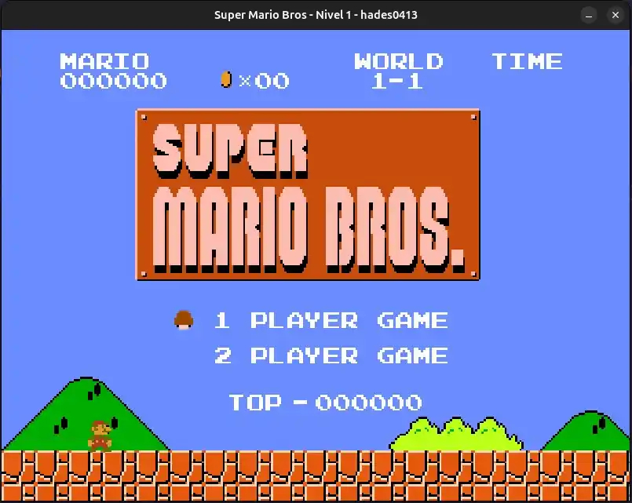
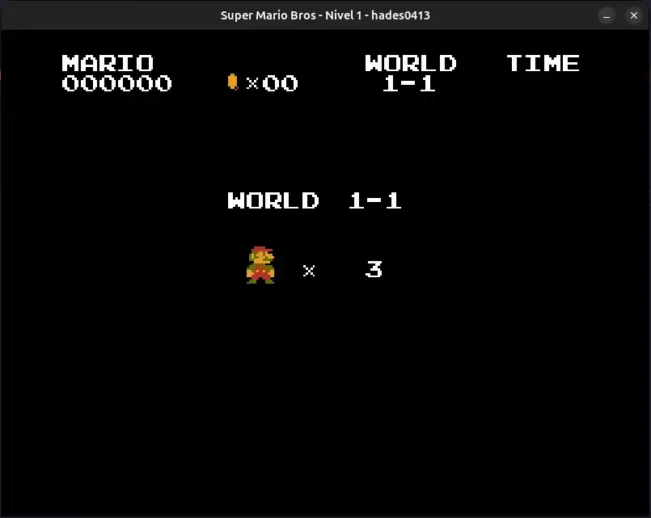
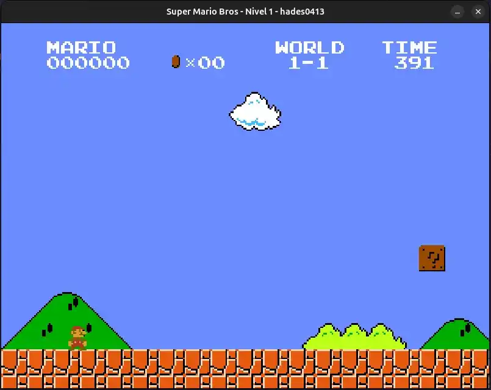
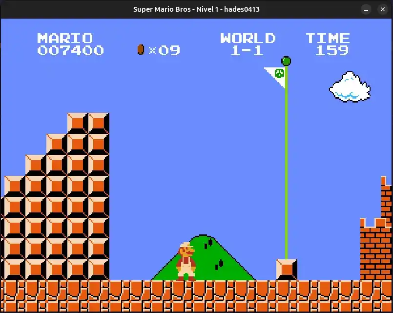
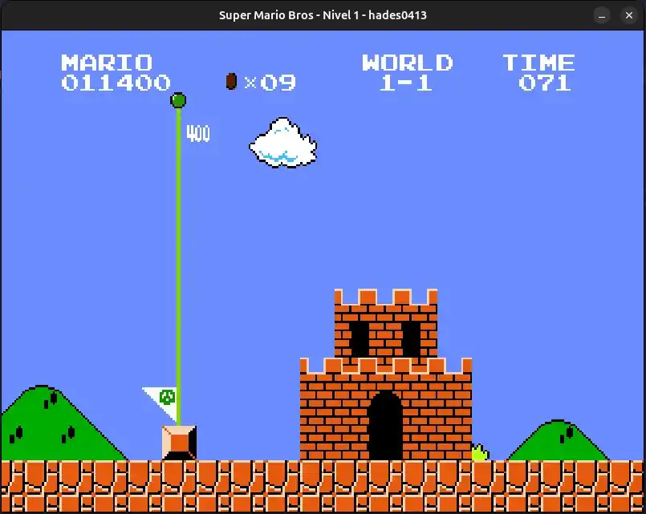
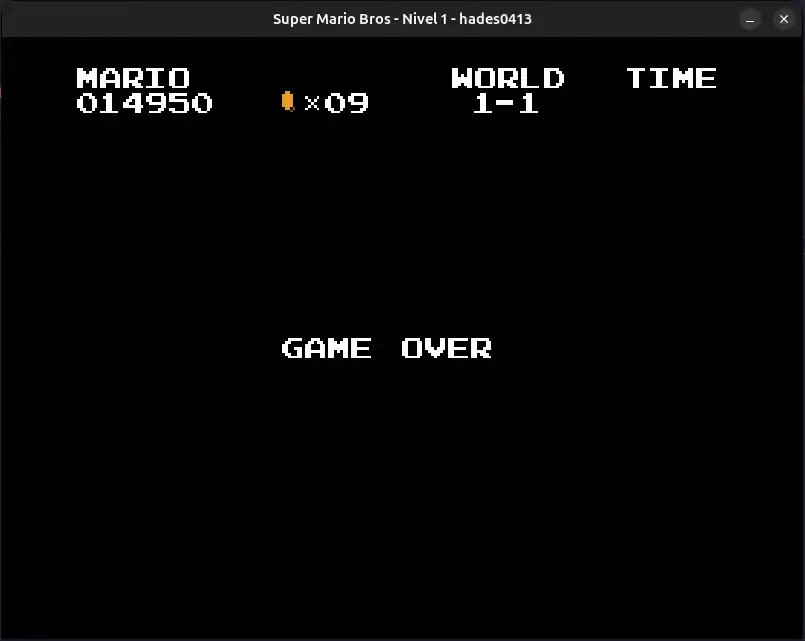

# Plutón/Mario-lvl1

**Plutón/Mario-lvl1**! es un juego de plataformas creado con Python y Pygame, inspirado en los clásicos juegos de Mario. El proyecto presenta mecánicas de juego como movimiento del jugador, gestión de enemigos, niveles, y eventos del juego como "game over", "victoria" y "pérdida de tiempo". Todo el flujo del juego está organizado en diferentes "estados" que controlan cada fase o pantalla.

## Índice

- [Descripción del Proyecto](#descripción-del-proyecto)
- [Tecnologías Utilizadas](#tecnologías-utilizadas)
- [Estructura del Proyecto](#estructura-del-proyecto)
- [Clases y Funciones Principales](#clases-y-funciones-principales)
- [Tecnologías Utilizadas](#tecnologías-utilizadas)
- [Uso](#uso)
- [Constantes Importantes](#constantes-importantes)
- [Licencia](#licencia)
- [Imágenes y Videos](#imágenes-y-videos)

## Descripción del Proyecto

**Plutón/Mario-lvl1** es un juego de plataformas inspirado en la serie Super Mario Bros., con mecánicas de desplazamiento, salto, combate y recogida de objetos. El jugador controla a Mario en su aventura para superar obstáculos, derrotar enemigos y alcanzar el final del nivel. El juego cuenta con varios estados como menús, pantallas de carga y niveles, y está diseñado para ofrecer una experiencia clásica de arcade.

## Tecnologías Utilizadas

Este proyecto utiliza las siguientes tecnologías y herramientas:

- **Python:** Lenguaje de programación utilizado para desarrollar el juego.

- **Pygame:** Biblioteca usada para la creación de gráficos, sonido y eventos.

- **Pygame Mixer:** Para la gestión de música y efectos sonoros.

- **Diccionarios de recursos:** Para cargar y gestionar gráficos, sonidos y música de forma eficiente.

## Estructura del Proyecto

El proyecto sigue una estructura modular, donde cada componente del juego (estado, recursos, sonido, control) se encuentra en archivos separados:

```
├── 📁game
│   ├── __init__.py
│   ├── constants.py
│   ├── setup.py
│   ├── tools.py
│   ├── states
│   │   ├── main_menu.py
│   │   ├── load_screen.py
│   │   └── level1.py
│   ├── sound.py
│   ├── control.py
│   ├── graphics.py
│   └── music.py
└── resources
    ├── fonts
    ├── graphics
    ├── music
    └── sound

```

## Clases y Funciones Principales

### 1. Clase Control

La clase Control gestiona el bucle principal del juego, controlando la actualización de los estados y la gestión de los eventos.

```bash
class Control:
    def __init__(self, caption):
        # Inicializa el control del juego, configurando la pantalla, el bucle de eventos y el reloj.
        ...

    def setup_states(self, state_dict, start_state):
        # Configura los estados iniciales del juego
        ...

    def update(self):
        # Actualiza el estado actual del juego
        ...

    def event_loop(self):
        # Bucle de eventos que maneja los eventos de teclado y cierre de ventana
        ...

    def main(self):
        # Bucle principal que ejecuta el juego
        ...

```

### 2. Clase Sound:

La clase Sound maneja todo lo relacionado con la música y efectos sonoros, cambiando las pistas de acuerdo al estado del juego (por ejemplo, cuando el jugador muere, o cuando llega al final del nivel).

```bash
class Sound:
    def __init__(self, overhead_info):
        # Inicializa los diccionarios de música y efectos, y ajusta la música según el estado del juego.
        ...

    def set_music_mixer(self):
        # Configura la música dependiendo del estado del juego
        ...

    def update(self, game_info, mario):
        # Actualiza la información del juego y maneja la música
        ...

    def play_music(self, key, state):
        # Reproduce la música correspondiente según la clave y el estado
        ...

    def stop_music(self):
        # Detiene la música actual
        ...

```

### 3. Clase \_State

La clase \_State sirve como una clase base para todos los estados del juego. Cada estado tiene métodos para manejar eventos, iniciar y limpiar recursos, y actualizar la pantalla.

```bash
class _State:
    def __init__(self):
        self.start_time = 0.0
        self.current_time = 0.0
        self.done = False
        self.quit = False
        self.next = None
        self.previous = None
        self.persist = {}

    def get_event(self, event):
        pass

    def startup(self, current_time, persistant):
        # Configura el estado inicial
        ...

    def cleanup(self):
        # Limpia el estado antes de cambiar
        ...

    def update(self, surface, keys, current_time):
        # Actualiza el estado
        ...

```

### 4. Funciones de carga de recursos

Estas funciones cargan los recursos gráficos, musicales y de efectos de sonido desde los directorios correspondientes.

```bash
def load_all_gfx(directory, colorkey=(255,0,255), accept=('.png', 'jpg', 'bmp')):
    # Carga todos los gráficos desde un directorio dado
    ...

def load_all_music(directory, accept=('.wav', '.mp3', '.ogg', '.mdi')):
    # Carga todas las canciones desde un directorio dado
    ...

def load_all_fonts(directory, accept=('.ttf')):
    # Carga todas las fuentes desde un directorio dado
    ...

def load_all_sfx(directory, accept=('.wav','.mpe','.ogg','.mdi')):
    # Carga todos los efectos de sonido desde un directorio dado
    ...

```

## Constantes Importantes

El juego tiene diversas constantes que definen el comportamiento del mundo del juego y los elementos interactivos. Aquí algunas de las más importantes:

### 1. Dimensiones de la Pantalla

```bash
SCREEN_WIDTH: Ancho de la pantalla (800 píxeles)
```

```bash
SCREEN_HEIGHT: Alto de la pantalla (600 píxeles)
```

```bash
SCREEN_SIZE: Tupla que combina el ancho y el alto de la pantalla
```

### 2. Colores

```bash

GRAY, NAVYBLUE, WHITE, RED, GREEN, etc., son colores utilizados para diferentes elementos del juego, definidos como tuplas RGB.
```

### 3. Parámetros de Juego

```bash
WALK_ACCEL, RUN_ACCEL: Aceleración de Mario al caminar y correr.
```

```bash
GRAVITY, JUMP_GRAVITY: Gravedad aplicada a Mario y su salto.
```

```bash
JUMP_VEL, FAST_JUMP_VEL: Velocidad de salto y salto rápido.
```

### 4. Estados de Mario

```bash
STAND, WALK, JUMP, FALL: Diferentes estados de Mario mientras juega.
```

```bash
BIG_TO_SMALL, BIG_TO_FIRE: Cambios de tamaño de Mario y sus poderes.
```

### 5. Estados de Enemigos

```bash
GOOMBA, KOOPA: Tipos de enemigos en el juego.
```

```bash
SHELL_SLIDE: Estado para Koopa cuando su cáscara es deslizante.
```

### 6. Otros Estados del Juego

```bash
MAIN_MENU, LOAD_SCREEN, LEVEL, GAME_OVER: Estados principales que representan el menú, carga de pantalla y el nivel del juego.
```

```bash
NORMAL, STAGE_CLEAR, WORLD_CLEAR: Estados relacionados con la música y el sonido según el avance en el juego.
```

### 6. Objetos y Recompensas

```bash
MUSHROOM, STAR, FIREFLOWER: Objetos recogidos por Mario para obtener poder o vidas extras.
```

```bash
COIN, LIFE_MUSHROOM: Monedas y setas 1UP.
```

## Uso

### 1. Ejecución del Juego

Clona o descarga el repositorio:

```bash
git clone https://github.com/Hades0413/Mario-lvl1.git
cd Mario-lvl1
```

### 2. Personalización

```bash
pip install pygame
```

### 3. Personalización

```bash
python mario_level_1.py
```

### 4. Personalización

```bash
Teclas de Acción: Puedes personalizar las teclas del jugador editando el diccionario keybinding en el archivo control.py.
```

```bash
Recursos: Los gráficos, música y sonidos se encuentran en el directorio resources. Puedes añadir tus propios recursos reemplazando los archivos existentes.
```

## Contribuyentes

```bash
Eduardo Miguel Jaime Gomero (Hades0413)
```

## Licencia

Este proyecto está bajo la Licencia MIT. Puedes usar, modificar y distribuir el código con fines personales o comerciales.

## Imágenes y Videos

### Imágenes:

A continuación, se muestran algunas imágenes del formulario de autenticación (AuthForm) y otras vistas relevantes:

1. 
2. 
3. 
4. 
5. 
6. 
7. 

Videos:
Demo del Proyecto:
Cómo ejecutar el Proyecto:

```

```
